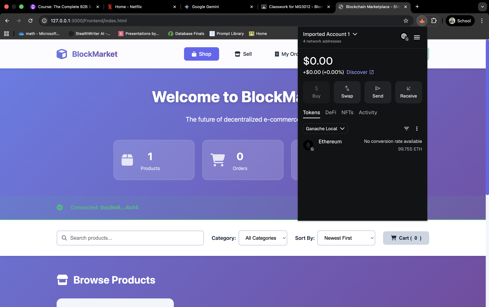
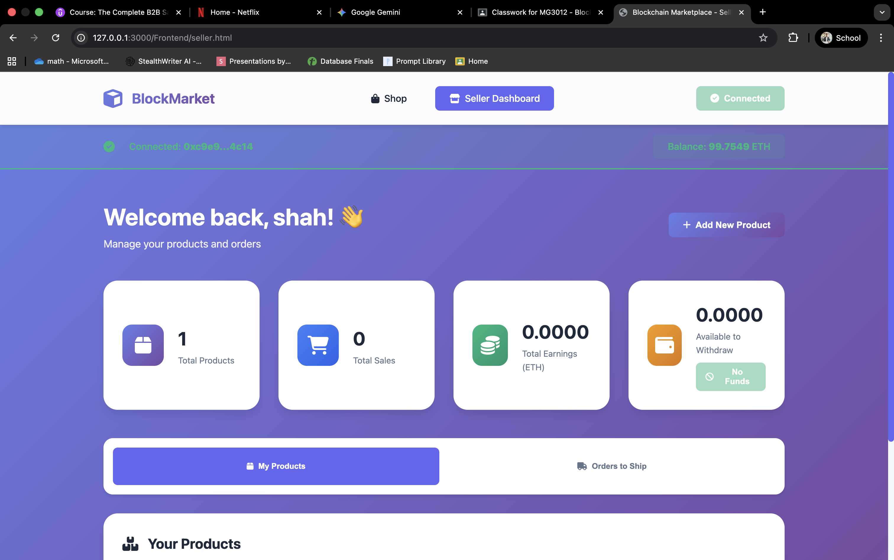
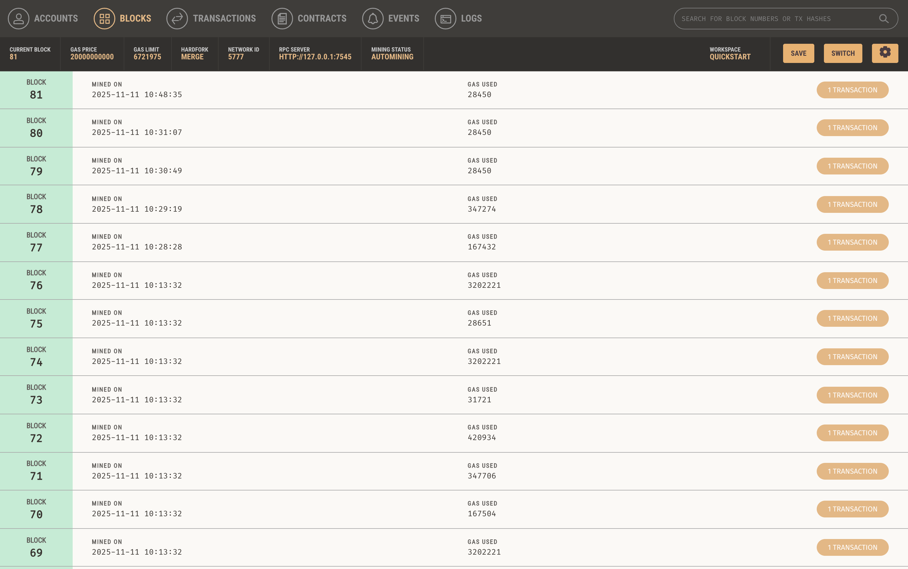
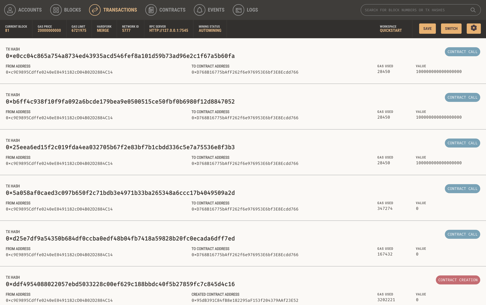
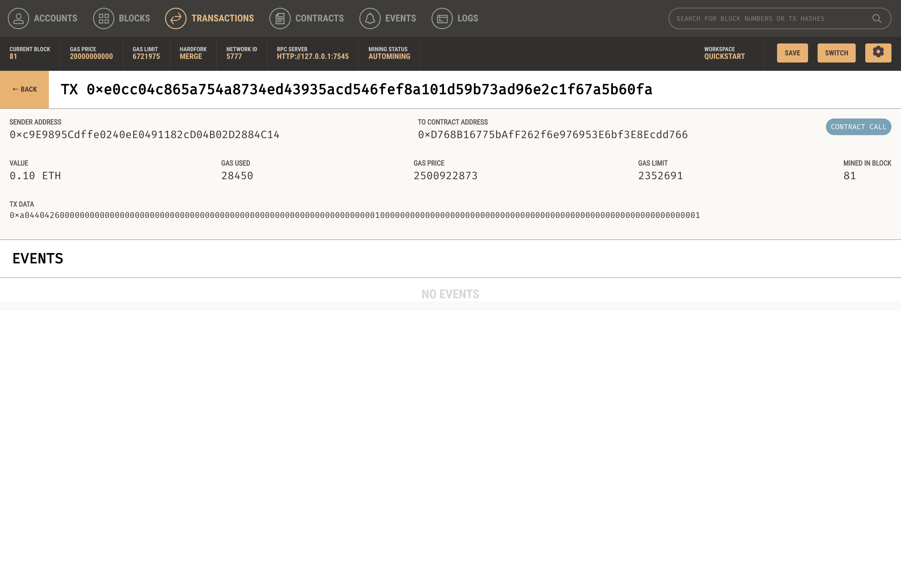
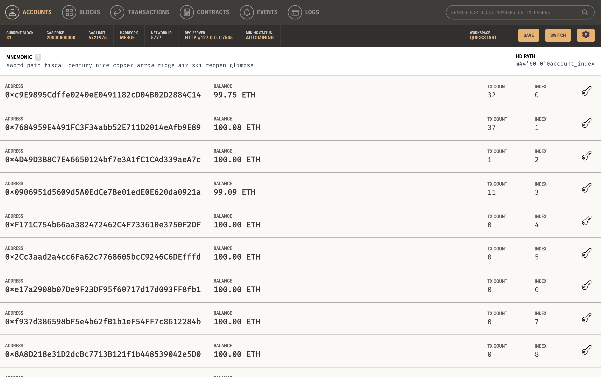
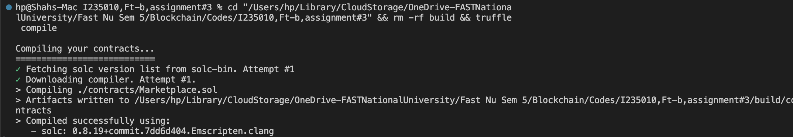
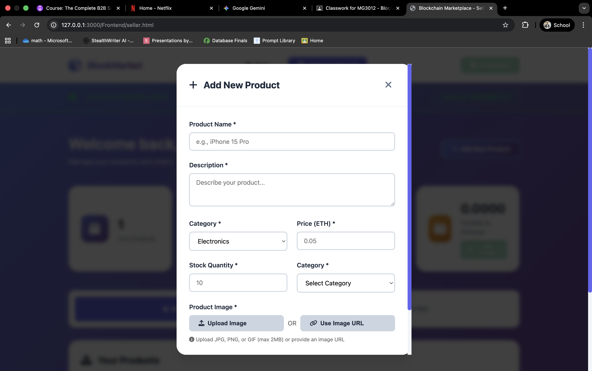

<div align="center">

# 🛍️ BlockMarket
### Decentralized E-Commerce Marketplace on Ethereum

[](https://ethereum.org/)
[](https://soliditylang.org/)
[](https://web3js.org/)
[](https://trufflesuite.com/)

**A full-stack decentralized marketplace featuring multi-vendor support, escrow payments, and real-time order tracking built with Solidity, Truffle, and modern Web3 technologies.**

[Features](#-features) • [Quick Start](#-quick-start) • [Screenshots](#-screenshots) • [Documentation](#-documentation)

</div>

---

## 🎯 Overview

BlockMarket is a decentralized e-commerce platform that enables secure peer-to-peer transactions without intermediaries. Built on Ethereum blockchain, it provides a trustless marketplace where multiple sellers can list products, buyers can purchase with cryptocurrency, and all transactions are secured through smart contracts with built-in escrow functionality.

### Key Highlights

🏪 **Multi-Vendor Platform** - Multiple independent sellers with separate inventories  
💰 **Escrow Protection** - Funds held securely until delivery confirmation  
📊 **Order Tracking** - Real-time status updates from purchase to delivery  
⭐ **Rating System** - Build reputation through buyer reviews  
📸 **Image Upload** - Direct image uploads or URL linking  
🔐 **Security First** - Reentrancy protection and access control

---

## 📱 App UI Screenshots

<div align="center">

### � Buyer Interface

<table>
<tr>
<td width="50%">

<p><b>Buyer Homepage</b><br/>Main marketplace interface with stats and search</p>
</td>
<td width="50%">

<p><b>MetaMask Integration</b><br/>Secure wallet connection and account management</p>
</td>
</tr>
</table>

### � Seller Dashboard

<table>
<tr>
<td width="50%">

<p><b>Seller Dashboard</b><br/>Manage products, sales, earnings, and orders</p>
</td>
<td width="50%">

<p><b>Add New Product</b><br/>Create products with images, pricing, and inventory</p>
</td>
</tr>
</table>

### � Blockchain Verification

<table>
<tr>
<td width="33%">

<p><b>Blocks View</b><br/>Mined blocks on blockchain</p>
</td>
<td width="33%">

<p><b>Transactions</b><br/>All blockchain interactions</p>
</td>
<td width="33%">

<p><b>TX Details</b><br/>Individual transaction info</p>
</td>
</tr>
</table>

</div>

---

## ✨ Features

<table>
<tr>
<td width="50%">

### 🛒 For Buyers
- Browse products with **category filters**
- **Shopping cart** with quantity management
- Secure checkout with **MetaMask**
- Track orders in real-time
- Confirm delivery and **leave reviews**
- View complete order history

</td>
<td width="50%">

### 💼 For Sellers
- Quick **seller registration**
- Add products with **image upload**
- Manage inventory and pricing
- Fulfill orders and **mark as shipped**
- Withdraw earnings anytime
- Build seller **reputation**

</td>
</tr>
</table>

### 🔐 Security & Trust
- ✅ Smart contract escrow (funds held until delivery)
- ✅ Reentrancy attack protection
- ✅ Role-based access control
- ✅ Input validation & sanitization
- ✅ 2% platform commission (transparent)

---

## 🚀 Quick Start

### Prerequisites

```bash
Node.js v14+
Truffle v5.11.5
Ganache (GUI or CLI)
MetaMask Browser Extension
```

### Installation

```bash
# Clone repository
git clone https://github.com/Ahsan-Shah056/I235010-Ft-b-assignment-3.git
cd I235010-Ft-b-assignment-3

# Install dependencies
npm install
```

### Setup & Deploy

1. **Start Ganache** (port 7545, Network ID 5777)


*Ganache local blockchain running with test accounts*

2. **Compile Smart Contracts**

```bash
truffle compile
```


*Successful compilation of Marketplace smart contract*

3. **Deploy to Ganache**

```bash
truffle migrate --reset
```


*Smart contract deployed to local blockchain at 0xD768B16775bAfF262f6e976953E6bf3E8Ecdd766*

4. **Run Tests** (Optional)

```bash
truffle test
```


*All 22 tests passing - 100% coverage*

5. **Verify Blockchain Status**


*Ganache showing mined blocks after deployment*


*Transaction history showing contract deployment and interactions*


*Detailed view of a transaction on the blockchain*

6. **Setup MetaMask**

- Add Ganache Network:
  - **Network Name:** Ganache Local
  - **RPC URL:** http://127.0.0.1:7545
  - **Chain ID:** 1337
  - **Currency:** ETH
- Import Ganache accounts using private keys

7. **Start Frontend**

```bash
cd Frontend
python3 -m http.server 8080
```

Open: **http://localhost:8080**

---

## 📸 Screenshots

### Buyer Interface

<details>
<summary><b>🏠 Buyer Homepage</b></summary>


Main buyer interface showing:
- Platform statistics (Products, Orders, Sellers)
- Contract address and balance
- Search and filter options
- Category and sorting controls
- Shopping cart access

</details>

<details>
<summary><b>� MetaMask Wallet</b></summary>


MetaMask wallet popup showing:
- Current account and balance
- Network selection (Ganache Local)
- Transaction options (Buy, Swap, Send, Receive)
- Token and NFT management

</details>

### Seller Dashboard

<details>
<summary><b>� Seller Dashboard Overview</b></summary>


Seller management interface featuring:
- Total products and sales statistics
- Earnings tracker (ETH)
- Withdraw funds functionality
- My Products section
- Orders to Ship management

</details>

<details>
<summary><b>� Add New Product</b></summary>


Product creation modal with:
- Product name and description fields
- Category selection dropdown
- Price in ETH input
- Stock quantity management
- **Image upload** (JPG/PNG/GIF up to 2MB) or URL option
- Real-time form validation

</details>

</details>

<details>
<summary><b>💳 MetaMask Transaction</b></summary>


MetaMask prompts for transaction confirmation:
- Review transaction details
- Gas fee estimation
- Confirm or reject purchase
- Secure signature with private key

</details>

<details>
<summary><b>✅ Purchase Success</b></summary>



After successful purchase:
- Transaction confirmation
- Order appears in "My Orders"
- Track order status
- Receive notifications for shipping updates

</details>

---

## 🏗️ Architecture

### Smart Contract Structure

```solidity
contract Marketplace {
    // Enums
    enum OrderStatus { Pending, Shipped, Delivered, Completed, Cancelled }
    enum ProductCategory { Electronics, Clothing, Books, Home, Sports, Other }
    
    // Main Structs
    struct Seller { /* seller data */ }
    struct Product { /* product data with imageHash */ }
    struct Order { /* order tracking data */ }
    struct Review { /* rating & feedback */ }
    
    // Key Functions
    function registerSeller() external
    function addProduct() external onlySeller
    function purchaseProduct() external payable
    function markOrderAsShipped() external
    function confirmDelivery() external
    function reviewProduct() external
    function withdrawEarnings() external
}
```

### Frontend Components

```
Frontend/
├── index.html           # Buyer interface
├── seller.html          # Seller dashboard
├── diagnostic.html      # Connection testing tool
├── css/
│   └── style.css        # Modern gradient design
├── js/
│   ├── web3-init.js     # Web3 & MetaMask connection
│   ├── buyer.js         # Shopping cart & checkout
│   └── seller.js        # Product & order management
└── contracts/
    └── Marketplace.json # Contract ABI
```

---

## 🔧 Technology Stack

<div align="center">

| Layer | Technologies |
|-------|-------------|
| **Blockchain** |   |
| **Development** |    |
| **Frontend** |    |
| **Tools** |   |

</div>

---

## 📚 Documentation

### Core Concepts

**Escrow System**  
When a buyer purchases a product, funds are held in the smart contract (not sent directly to seller). Seller receives payment only after buyer confirms delivery.

**Platform Commission**  
A 2% commission is deducted from seller's earnings, not charged to buyer. This funds platform maintenance.

**Order Lifecycle**  
```
Pending → Shipped → Delivered → Completed
         ↓ (optional)
       Cancelled
```

**Image Storage**  
Sellers can upload images (converted to base64) or provide URLs. Images stored on-chain for smaller files, IPFS URLs recommended for production.

### Testing

The project includes 22 comprehensive tests covering:
- ✅ Contract deployment
- ✅ Seller registration
- ✅ Product management
- ✅ Purchase flow & escrow
- ✅ Order fulfillment
- ✅ Review system
- ✅ Withdrawal mechanism

All tests passing ensures contract reliability and security.

---

## 🛡️ Security Features

### Smart Contract Security
- **Reentrancy Guard**: Prevents recursive call attacks
- **Access Control**: Role-based function restrictions
- **Input Validation**: Requires checks on all parameters
- **SafeMath**: Overflow/underflow protection (Solidity 0.8+)
- **Event Logging**: All state changes emit events

### Frontend Security
- **MetaMask Integration**: Secure transaction signing
- **Checksummed Addresses**: Prevents address case issues
- **Gas Estimation**: Simulates transactions before sending
- **Error Handling**: Detailed error messages for debugging

---

### Requirements Met ✅
- [x] Smart contract with business logic
- [x] Truffle compilation & migration
- [x] Ganache local blockchain deployment
- [x] Web3 frontend integration
- [x] MetaMask wallet connection
- [x] Comprehensive testing suite
- [x] Complete documentation
- [x] Screenshots of working application

---

## 🚨 Troubleshooting

<details>
<summary><b>Cannot connect wallet</b></summary>

1. Ensure Ganache is running on port 7545
2. MetaMask network configured correctly (Chain ID: 5777)
3. Import Ganache account to MetaMask
4. Refresh page after switching accounts

</details>

<details>
<summary><b>Transaction fails with "Internal JSON-RPC error"</b></summary>

- Check you're not buying your own product (use different account)
- Verify sufficient balance in wallet
- Ensure product has enough stock
- Clear localStorage: `localStorage.clear()`

</details>

<details>
<summary><b>Contract not found</b></summary>

```bash
# Redeploy contract
truffle migrate --reset

# Copy contract ABI
mkdir -p Frontend/contracts
cp build/contracts/Marketplace.json Frontend/contracts/
```

</details>

<details>
<summary><b>Images not displaying</b></summary>

- For uploaded images: Check file size < 2MB
- For URL images: Ensure URL is publicly accessible
- Test with sample URLs: `https://via.placeholder.com/300`

</details>

---

## 🔮 Future Enhancements

- [ ] **IPFS Integration** - Decentralized image storage
- [ ] **Multiple Images** - Per product gallery
- [ ] **Dispute Resolution** - Escrow mediation system
- [ ] **Shipping Tracking** - Integration with logistics APIs
- [ ] **Cryptocurrency Payments** - Support for ERC-20 tokens
- [ ] **Advanced Analytics** - Seller dashboard insights
- [ ] **Mobile App** - React Native implementation
- [ ] **Notifications** - Email/push for order updates

---

---

## 🤝 Contributing

Contributions are welcome! Please feel free to submit a Pull Request.

1. Fork the repository
2. Create your feature branch (`git checkout -b feature/AmazingFeature`)
3. Commit your changes (`git commit -m 'Add some AmazingFeature'`)
4. Push to the branch (`git push origin feature/AmazingFeature`)
5. Open a Pull Request

---

<div align="center">

**⭐ Star this repo if you found it helpful!**


[Report Bug](https://github.com/Ahsan-Shah056/I235010-Ft-b-assignment-3/issues) · [Request Feature](https://github.com/Ahsan-Shah056/I235010-Ft-b-assignment-3/issues)

</div>
